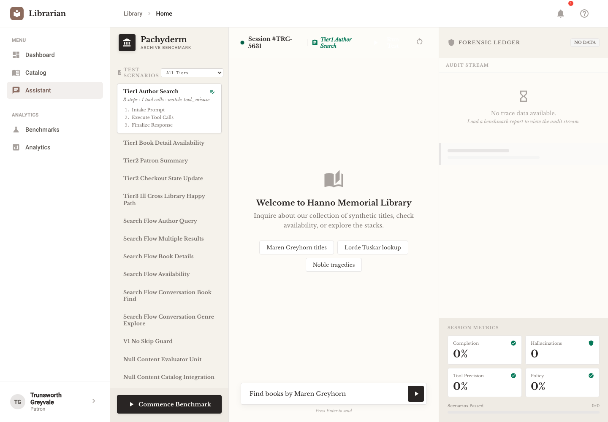
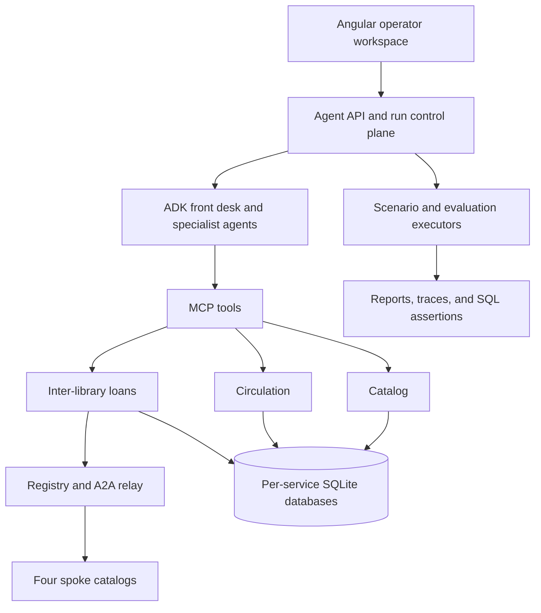

<div align="center">

# Pachyderm Library

### Can an LLM run a library?

An instrumented, fictional library network for evaluating stateful AI agents.

[](https://github.com/DanielMercado60660/ai-library-evaluation/actions/workflows/ci.yml)


[](LICENSE)


[Try the harness](#try-the-harness) · [Explore the architecture](#architecture) · [Research vision](ProjectGoal.md) · [Setup guide](docs/development/QUICK_START.md)

</div>

A library gives an AI agent more to do than answer questions. It must find the
right book, check availability, respect borrowing rules, manage holds and fines,
and coordinate loans across institutions while protecting patron information.
This project makes those operations observable and testable.

The setting is the **Pachyderm Library Network**: five fictional libraries and a
635-book seed manifest populated with elephant-themed literature. Titles such as
*Tusk and Sensibility* make the catalog a source the agent must consult. Fiction
reduces reliance on familiar book knowledge and gives the evaluator controlled
ground truth for detecting unsupported claims.

## What makes it interesting

- **Stateful operations:** catalog search, checkouts, returns, hold queues,
  fines, and inter-library loans backed by SQLModel databases.
- **Agent orchestration:** a Google ADK front desk delegates to catalog,
  circulation, and loan specialists through MCP tools.
- **Federation:** a hub and four spoke catalogs, with a registry-hosted A2A
  relay for loan coordination and tests for information boundaries.
- **Evidence beyond the answer:** JSONL traces, database assertions for
  inventory and financial integrity, safety packs, and reproducible faults.
- **An operator workspace:** Angular views for chat, scenario execution,
  benchmark runs, reports, analytics, and trace replay.

## Operator workspace



*Actual Angular UI with mocked backend responses; this preview contains no live
model result.*

## Architecture



| Area | Implementation | Location |
|---|---|---|
| Library services | FastAPI, SQLModel, SQLite, Celery/Redis for ILL tasks | [`services/`](services/) |
| Agents and run control | Google ADK, Gemini client, MCP connections | [`agents/`](agents/) |
| Shared contracts | Pydantic schemas, auth, observability, trace models | [`shared/`](shared/) |
| Operator UI | Angular 18, Material, SCSS, Playwright | [`frontend/`](frontend/) |
| Evaluation | pytest scenarios, safety packs, forensic SQL, fault profiles | [`tests/scenarios/`](tests/scenarios/) |
| Fictional world | Catalogs, patrons, federation manifest, world guide | [`data/`](data/), [`docs/world/`](docs/world/) |

The configured federation has separate catalog databases. Agent and run
orchestration currently live in a central service; independent agent stacks at
every library remain a research direction.

## Try the harness

Requires **Python 3.12** and **uv**. The deterministic harness needs no API key
or running Docker services.

```bash
git clone https://github.com/DanielMercado60660/ai-library-evaluation.git
cd ai-library-evaluation
uv sync --frozen --all-packages

# Service, scenario, and agent regression tests
uv run pytest -q

# Small deterministic benchmark; writes reports under artifacts/
uv run python scripts/benchmark_run.py --suite smoke
```

For the full deterministic scenario pack:

```bash
uv run python scripts/benchmark_run.py --suite scenarios --include-adk
```

**What this proves:** the harness, business rules, integrations, and configured
ADK topology behave as tested. `--include-adk` uses a deterministic adapter with
synthetic traces. It does not run live model inference or establish LLM quality.

## Run the local demo

Requires Docker Compose. Set a Google API key in your local `.env` to use live
Gemini chat, and choose a `MODEL_NAME` available to your account.

```bash
cp .env.example .env
# Edit .env locally; never commit it.
docker compose -f docker-compose.yml -f docker-compose.demo.yml up --build -d
```

Open **http://localhost:4200**. The demo override enables authenticated
reset-and-seed endpoints for disposable evaluation data. Follow the
[setup guide](docs/development/QUICK_START.md#seed-the-demo) to populate the core
services. The regular Compose file also defines the four spoke catalogs.

The UI separates evaluation runs from benchmark runs. Inspect the executor
mode, model, trace, and final state when comparing live models. Keep
`EVAL_SHORTCUTS_ENABLED=false` when measuring model behavior.

## Project status

**Local research alpha.** The project includes service and agent regression
suites, an Angular operator UI, and deterministic evaluation infrastructure.
Live model performance and production readiness are separate validation tasks.

The shared development service token and browser-selected patron identity are
demo mechanisms. This is a controlled research environment for fictional data;
see [security notes](SECURITY.md) before adapting it for a real system.

Current validation evidence and its limits are recorded in
[publication readiness](docs/status/PUBLICATION_READINESS.md). Historical
implementation notes remain in [project status](docs/status/PROJECT_STATUS.md)
and the [archive](docs/archive/).

## Explore further

- [Research question and methodology](ProjectGoal.md)
- [Architecture overview](docs/architecture/OVERVIEW.md) and [decision records](docs/architecture/adr/INDEX.md)
- [Benchmark runbook](docs/development/BENCHMARK_RUNBOOK.md)
- [Fictional world guide](docs/world/HANNO_WORLD_BIBLE.md)
- [Contributing](CONTRIBUTING.md) and [documentation index](docs/README.md)

## License and artwork

[MIT](LICENSE) · Created by Daniel Mercado.
The elephant banner was generated with OpenAI image generation for this project;
[artwork details](docs/assets/README.md) include the prompt and provenance.
